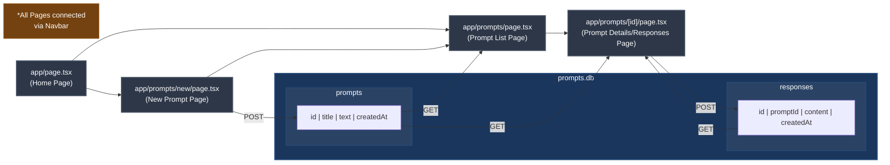

# Creative Writing Prompt & Response App

A Next.js application for creating and responding to writing prompts using the Lexical rich text editor.

## Installation & Running

```bash
npm install && npm run dev
```

## Architecture

- Built with Next.js 13+ App Router and TypeScript
- Uses Tailwind CSS for styling
- Implements Lexical editor for rich text responses
- Simple database storage via an SQLite file
- RESTful API routes for CRUD operations

## Project Structure

Simple:



Detailed:

```mermaid
graph LR
    %% Note at the top
    Note["*All Pages connected via Navbar<br>*Uses Client/Server Component Pattern<br>*Rich Text Editing with Lexical"]
    
    %% Pages and Components
    HomePage["app/page.tsx<br>(Home Page)"]
    
    subgraph PromptPages["Prompt Pages"]
        PromptList["app/prompts/page.tsx<br>(Server Component)"]
        ClientPromptList["ClientPromptsPage.tsx<br>(Client Component)"]
        
        NewPrompt["app/prompts/new/page.tsx<br>(Client Page)"]
        PromptForm["PromptForm.tsx<br>(Form Component)"]
        
        PromptDetails["app/prompts/[id]/page.tsx<br>(Client Page)"]
        LexicalEditor["LexicalEditor.tsx<br>(Rich Text Editor)"]
        ResponseDisplay["ResponseDisplay.tsx<br>(Content Display)"]
    end
    
    %% Shared Components
    subgraph SharedComponents["Shared Components"]
        Navbar["Navbar.tsx"]
        BackgroundAnimation["BackgroundAnimation.tsx"]
        EnhancedToolbar["EnhancedToolbarPlugin.tsx"]
    end
    
    %% Database
    subgraph DB["prompts.db"]
        subgraph Prompts["prompts"]
            PT["id | title | text | createdAt"]
        end
        subgraph Responses["responses"]
            RT["id | promptId | content | createdAt"]
        end
    end
    
    %% Component Relationships
    PromptList --> ClientPromptList
    NewPrompt --> PromptForm
    PromptDetails --> LexicalEditor
    PromptDetails --> ResponseDisplay
    LexicalEditor --> EnhancedToolbar
    
    %% Page Navigation
    HomePage --> PromptList
    HomePage --> NewPrompt
    ClientPromptList --> PromptDetails
    PromptForm --> |"on submit"| PromptList
    
    %% API Calls
    PT --> |"GET /api/prompts"| PromptList
    PT --> |"GET /api/prompts/:id"| PromptDetails
    RT --> |"GET /api/prompts/:id/responses"| PromptDetails
    PromptForm --> |"POST /api/prompts"| PT
    LexicalEditor --> |"POST /api/prompts/:id/responses"| RT
    
    %% Styling
    classDef page fill:#2d3748,stroke:#4a5568,stroke-width:2px,color:#fff
    classDef component fill:#4a5568,stroke:#718096,stroke-width:2px,color:#fff
    classDef database fill:#1a365d,stroke:#2c5282,stroke-width:2px,color:#fff
    classDef table fill:#2a4365,stroke:#2c5282,stroke-width:1px,color:#fff
    classDef note fill:#744210,stroke:#975a16,stroke-width:1px,color:#fff
    
    class HomePage,PromptList,NewPrompt,PromptDetails page
    class ClientPromptList,PromptForm,LexicalEditor,ResponseDisplay,Navbar,BackgroundAnimation,EnhancedToolbar component
    class DB database
    class Prompts,Responses table
    class Note note
```



```
+---app
ª   ª   favicon.ico
ª   ª   globals.css
ª   ª   layout.tsx
ª   ª   page.tsx
ª   +---api
ª   ª   +---prompts
ª   ª       ª   route.ts
ª   ª       +---[id]
ª   ª           ª   route.ts
ª   ª           +---responses
ª   ª                   route.ts
ª   +---lib
ª   ª       db.ts
ª   +---prompts
ª       ª   page.tsx
ª       +---new
ª       ª       page.tsx
ª       +---[id]
ª               page.tsx
+---components
ª       BackgroundAnimation.tsx
ª       ClientPromptsPage.tsx
ª       EnhancedToolbarPlugin.tsx
ª       LexicalEditor.tsx
ª       Navbar.tsx
ª       PromptForm.tsx
ª       PromptList.tsx
ª       ResponseDisplay.tsx
+---types
        index.ts
```

# Key Design Decisions/Notes Of Interest

1. App Router chosen for better performance and server components
2. SQLite Storage is a simple implementation for demonstration, a new file is created if it doesn't exist
3. Lexical integrated as a modular editor component with standard word processor formatting tools:
   - Bold, Italics, Underline, Font size, Text colour, Highlight colour, Font type, Bullet points and Numbered lists
   - Non-editable lexical text fields were used in the ResponseDisplay component to maintain formatting. Response content is stored in json string format with all
     rich-text state information preserved. 
4. TypeScript provides type safety and better development experience
5. Tailwind CSS is a rapid UI development with utility classes
6. Framer Motion UI provides enhanced front-end via smooth transitions
   - UI transitions needed to be separated from the api calls, so separate components are made for client and server side pages in some cases
7. CreatedAt added in database fields for both prompts and responses for extra details
8. Toolbar needed a click listener to update the state
9. All api calls are made asynchronously using 'await', basic loading states are added in the meantime.
